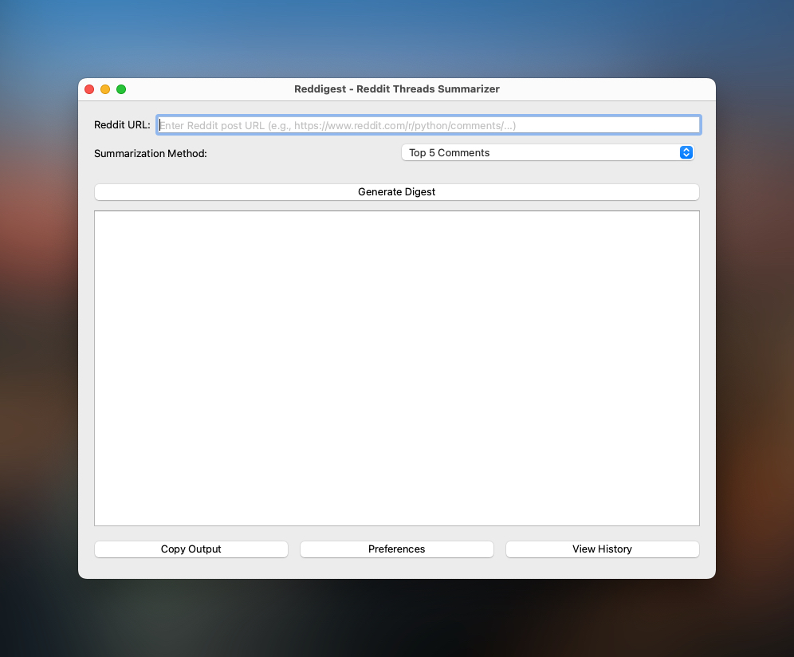
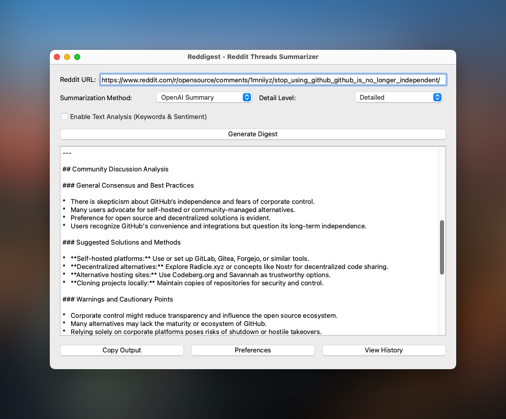
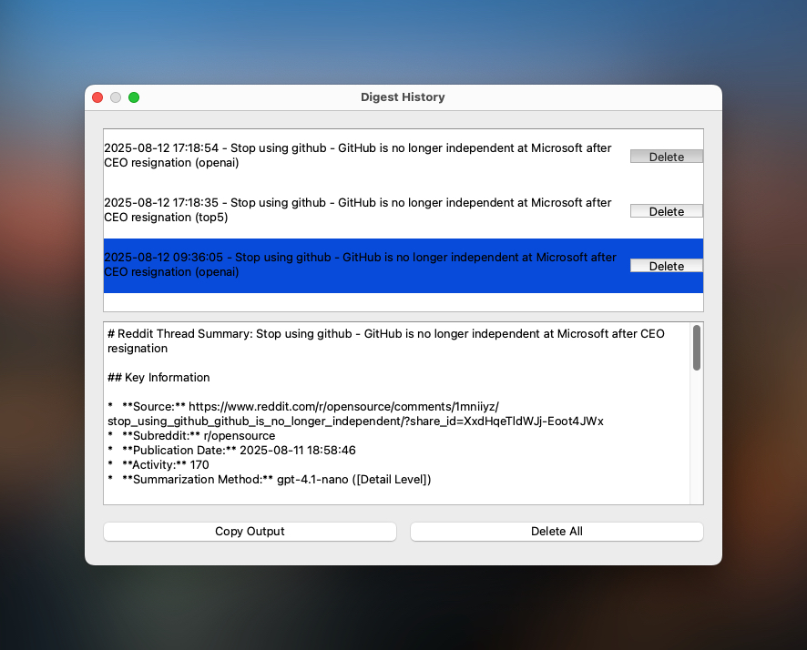
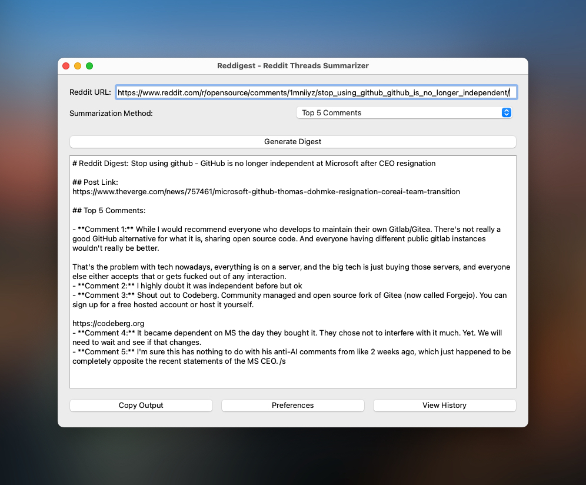

<h1 align="center">
  <a href="https://codeberg.org/medenor/reddigest">
    
  </a>
</h1>

<div align="center">
  Reddigest
  <br />
  <br />
  <a href="https://codeberg.org/medenor/reddigest/issues/new?assignees=&labels=bug&template=01_BUG_REPORT.md&title=bug%3A+">Report a Bug</a>
  ·
  <a href="https://codeberg.org/medenor/reddigest/issues/new?assignees=&labels=enhancement&template=02_FEATURE_REQUEST.md&title=feat%3A+">Request a Feature</a>
  .
  <a href="https://codeberg.org/medenor/reddigest/issues/new?assignees=&labels=question&template=04_SUPPORT_QUESTION.md&title=support%3A+">Ask a Question</a>
</div>

<div align="center">
<br />

[](LICENSE)
[](https://codeberg.org/medenor/reddigest/issues?q=is%3Aissue+is%3Aopen+label%3A%22help+wanted%22)
[](https://codeberg.org/medenor)
[](https://codeberg.org/medenor/promptvault/)
</div>

<details open="open">
<summary>Table of Contents</summary>

- [About](#about)
  - [Built With](#built-with)
- [Getting Started](#getting-started)
  - [Prerequisites](#prerequisites)
  - [Installation](#installation)
- [Usage](#usage)
- [Roadmap](#roadmap)
- [Support](#support)
- [Project assistance](#project-assistance)
- [Contributing](#contributing)
- [Authors & contributors](#authors--contributors)
- [Security](#security)
- [License](#license)
- [Acknowledgements](#acknowledgements)

</details>

---

## About

Reddigest is a Python application designed to generate digests from Reddit posts. It allows users to link a thread from a subreddit, and then generate a summary in Markdown format. The application also features a graphical user interface (GUI) for ease of use.

It offers two summarizing approaches: Top 5 comments or AI summary (OpenAI or Gemini) with configurable detail levels (Concise, Standard, Detailed). Users can bring their own keys (BYOK) for AI features. Digests can be output in Markdown format and saved to the clipboard. It also includes a Digest History to view and manage previously generated digests, and optional sentiment analysis for AI-generated summaries.

<details>
<summary>Screenshots</summary>
<br>

| Home Page | AI Summary Example |
| :---: | :---: |
|  |  |

| History Window | Top 5 Summary Example |
| :---: | :---: |
|  |  |

</details>

### Built With

*   Python
*   PRAW (Python Reddit API Wrapper)
*   OpenAI API
*   Google Gemini API

## Getting Started

### Prerequisites

*   Python 3.x
*   pip
*   Reddit API credentials
*   OpenAI API Key and/or Google Gemini API Key (optional, for AI summarization)

### Installation

To set up and run Reddigest, follow these steps:

1.  **Clone the repository:**
    ```bash
    git clone https://codeberg.org/medenor/reddigest.git
    cd reddigest
    ```

2.  **Create a virtual environment (recommended):**
    ```bash
    python3 -m venv .venv
    source .venv/bin/activate  # On Windows, use `venv\Scripts\activate`
    ```

3.  **Install dependencies:**
    ```bash
    pip install -r requirements.txt
    ```

4.  **Configure API Credentials (Reddit & AI):**
    This application interacts with the Reddit API (via PRAW) and optionally with OpenAI or Google Gemini for AI summarization. You need to set up your API credentials.

    **Recommended Method: Environment Variables (for security and flexibility)**
    It is highly recommended to use environment variables to store your sensitive API keys. The application will prioritize these variables over `praw.ini`.

    Create a file named `.env` in the root directory of the project (the same directory as `main.py` and `reddit_digest.py`). Add your credentials to this file in the format `KEY=VALUE`. This file should be added to the `.gitignore` (it already is by default).

    Example `.env` file:
    ```
    REDDIT_CLIENT_ID="your_reddit_client_id"
    REDDIT_CLIENT_SECRET="your_reddit_client_secret"
    REDDIT_USER_AGENT="Reddit Digest App by u/YourRedditUsername"
    # Optional, if using password-based authentication:
    # REDDIT_USERNAME="your_reddit_username"
    # REDDIT_PASSWORD="your_reddit_password"

    OPENAI_API_KEY="your_openai_api_key"
    GOOGLE_GEMINI_API_KEY="your_google_gemini_api_key"
    ```
    You can create a Reddit API application [here](https://www.reddit.com/prefs/apps).

    **Alternative Method: `praw.ini` file**
    If you prefer not to use environment variables, you can still use the `praw.ini` file.
    *   Rename `praw-example.ini` to `praw.ini`.
    *   Edit `praw.ini` and fill in your Reddit API credentials (client ID, client secret, user agent, username, password) and AI API keys.
    *   Note: Values in environment variables will override values in `praw.ini`.

    AI features are available on a bring-your-own-key (BYOK) basis, meaning you are responsible for any associated costs with enabling and using these features.

## Usage

To run the application, ensure your virtual environment is activated and execute the main GUI script:

```bash
source .venv/bin/activate
python main.py
```

This will launch the graphical interface where you can configure your digest generation options.

### Summary Methods

This project offers two main approaches for generating summaries:

-   **Top 5 Comments**  
    Displays the five most relevant or insightful comments to quickly gain community-based insight.

-   **AI Summary (OpenAI or Gemini)**  
    Utilizes an advanced language model (OpenAI or Gemini) to produce an overall summary, synthesizing the key points of the content.
    By default, "gpt-4.1-nano" (OpenAI) and "gemini-2.5-flash" (Google Gemini) are set as default summarization models in `model_preferences.json`. These are low costs models from both providers, with high context windows suitable for Reddit threads.

**When to use each method:**  
-   Prefer **Top 5 Comments** for a quick, community-driven overview.  
-   Use the **AI Summary** for a comprehensive, automatically generated synthesis.

## Roadmap

See the [open issues](https://codeberg.org/medenor/reddigest/issues) for a list of proposed features (and known issues).

- [Top Feature Requests](https://codeberg.org/medenor/reddigest/issues?q=label%3Aenhancement+is%3Aopen+sort%3Areactions-%2B1-desc) (Add your votes using the 👍 reaction)
- [Top Bugs](https://codeberg.org/medenor/reddigest/issues?q=is%3Aissue+is%3Aopen+label%3Abug+sort%3Areactions-%2B1-desc) (Add your votes using the 👍 reaction)
- [Newest Bugs](https://codeberg.org/medenor/reddigest/issues?q=is%3Aopen+is%3Aissue+label%3Abug)

## Support

Reach out to the maintainer at one of the following places:

- [GitHub issues](https://codeberg.org/medenor/reddigest/issues/new?assignees=&labels=question&template=04_SUPPORT_QUESTION.md&title=support%3A+)
- Contact options listed on [this GitHub profile](https://codeberg.org/medenor)

## Project assistance

If you want to say **thank you** or/and support active development of Reddigest:

- Add a [GitHub Star](https://codeberg.org/medenor/reddigest) to the project.
- Tweet about the Reddigest.
- Write interesting articles about the project on [Dev.to](https://dev.to/), [Medium](https://medium.com/) or your personal blog.

Together, we can make Reddigest **better**!

## Contributing

First off, thanks for taking the time to contribute! Contributions are what make the open-source community such an amazing place to learn, inspire, and create. Any contributions you make will benefit everybody else and are **greatly appreciated**.

Please read [our contribution guidelines](docs/CONTRIBUTING.md), and thank you for being involved!

## Authors & contributors

The original setup of this repository is by [Medenor](https://codeberg.org/medenor).

For a full list of all authors and contributors, see [the contributors page](https://codeberg.org/medenor/reddigest/contributors).

## Security

Reddigest follows good practices of security, but 100% security cannot be assured.
Reddigest is provided **"as is"** without any **warranty**. Use at your own risk.

_For more information and to report security issues, please refer to our [security documentation](docs/SECURITY.md)._

## License

This project is licensed under the **MIT license**.

See [LICENSE](LICENSE) for more information.

## Acknowledgements

* **Reddit and all related trademarks, logos, and other proprietary elements are owned by Reddit. This project is not affiliated with or endorsed by Reddit.**
* Repository files templates provided by [dec0dOS/amazing-github-template](https://github.com/dec0dOS/amazing-github-template)
